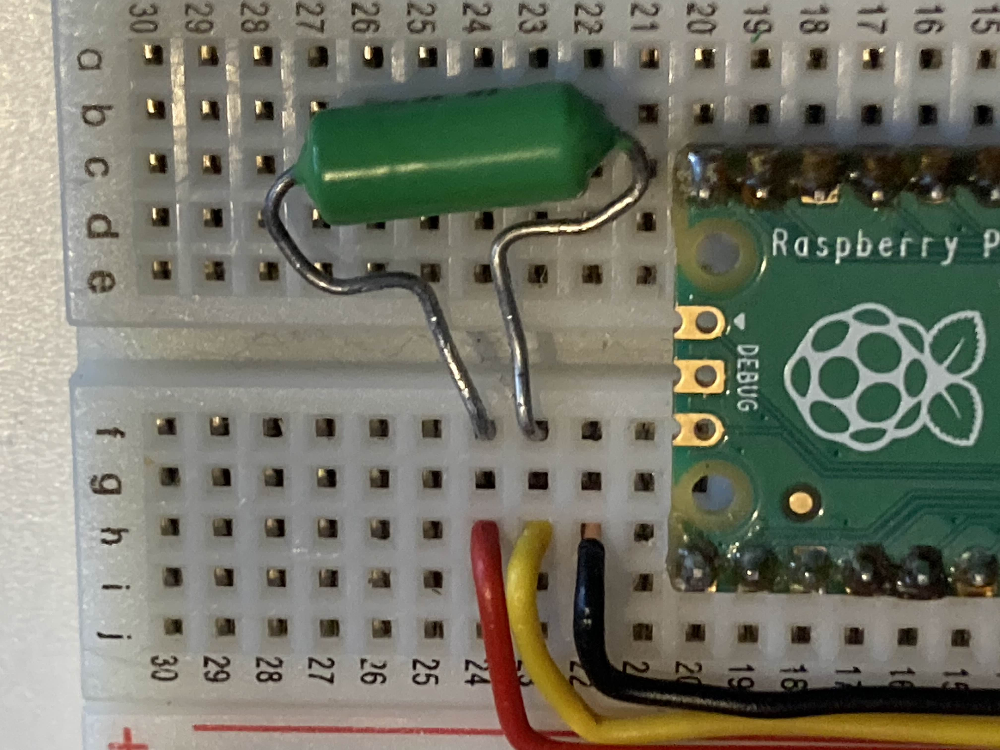
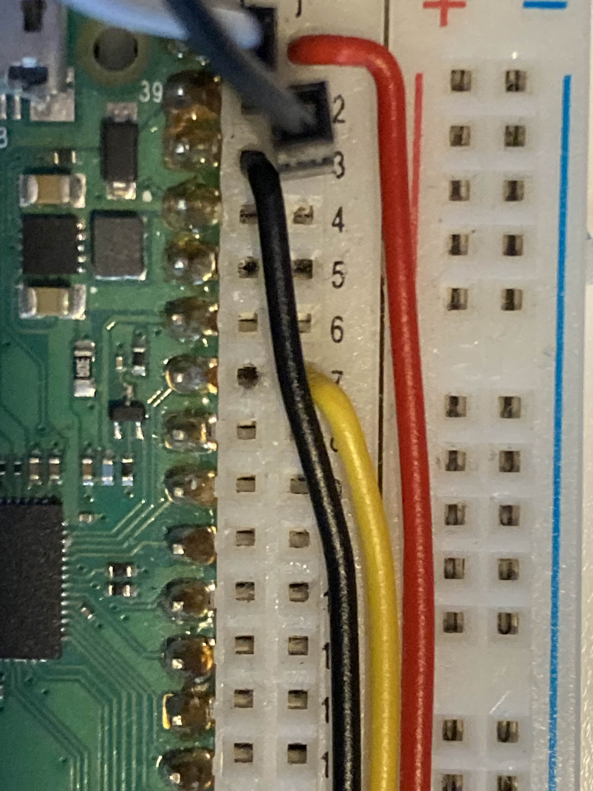
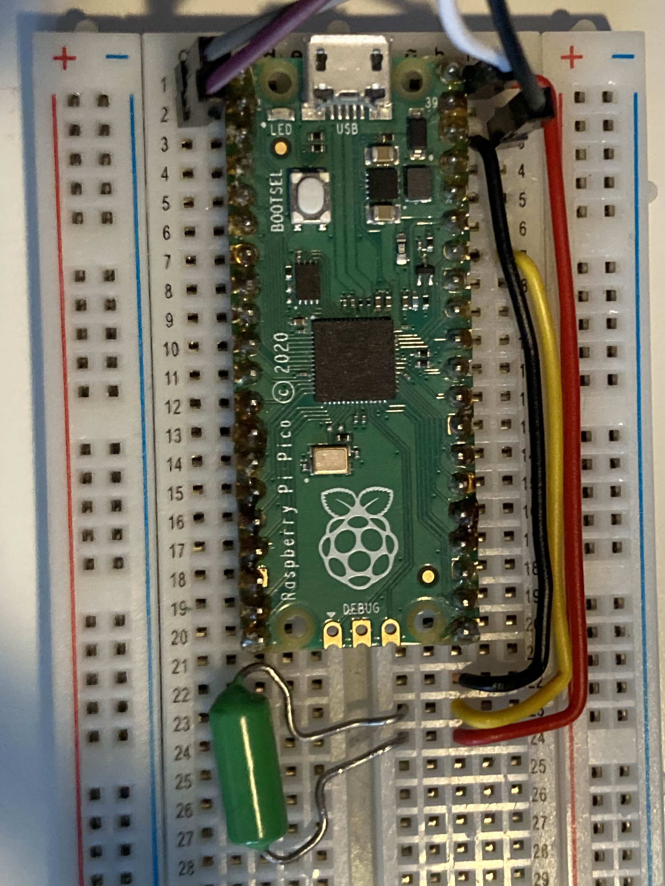

# RPI Temperature
Temperature measurement with RPI and temperature sensor using OneWire communication

# Physical Connection
The initial step is to connect the temperature sensor, which uses OneWire communication, to your RPI Pico.
 
 
 
 
 
Black is for GND 
Red is for VCC (5V) 
Yellow is for OW Communication (Pin 28) 
A resistor with a value of 6.04 KOhm is used to connect VCC and OW. 
 
The colors of the wires on the temperature sensor should be identical. Each wire should be connected to a corresponding wire of the same color (black to black, etc.). If a different temperature sensor is being used, the provided documentation should be read to ascertain the correct wiring procedure.
 
 
After this connect the I2C display to the I2C interface (SDA and SCL) and power (VCC and GND)  
   
After this your RPI Pico should be connected like this:  

